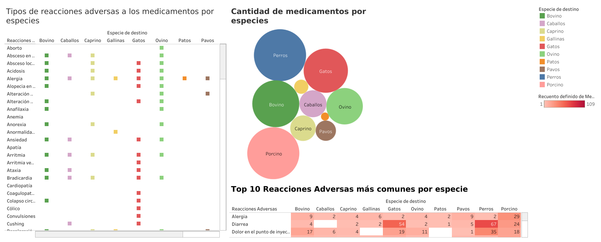
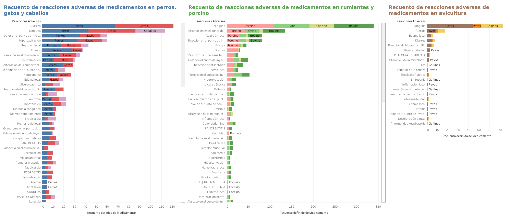

# 🐮🐷 Medicamentos veterinarios 🐔🐴 Visualization_proyect 🐶🐱

## Storytelling 
#### Introducción 

Un veterinario le ha preguntado a un funcionario de la agencia española de medicamentos y productos sanitarios (AEMPS) sobre los medicamentos veterinarios comercializados en España para las principales especies de compañía (perros, gatos y caballos) y de producción (vacunos, ovinos, capinos, porcinos, gallinas, pavos y patos). Quiere saber que especie posee más medicamentos, aunque por otro lado le preocupan también las posibles reacciones adversas de los mismos.

#### Desarrollo

En respuesta a la solicitud del veterinario, la AEMPS emprende una investigación sobre los medicamentos veterinarios en España para especies de compañía y producción. Descubren que, en términos de cantidad, los perros lideran, seguidos por porcinos, bovinos, gatos y ovinos. Sorprendentemente, en todas las especies, es más común que los medicamentos no generen reacciones adversas, destacando la seguridad general de la oferta farmacéutica. Se identifica una diferencia significativa en las aves de producción, que muestran menos tipos de reacciones adversas en comparación con mamíferos. Además, la diarrea se revela como la reacción adversa más frecuente en perros y gatos. Estos hallazgos guían a recomendaciones para diversificar la oferta según la demanda y ajustar formulaciones para garantizar la tolerancia de los medicamentos, destacando la importancia de la personalización en la industria veterinaria.

#### Conclusión

Las conclusiones a las que llegaron fueron las siguientes:
- Las 5 especies que más medicamentos tienen en orden son: perros, porcinos, bovinos, gatos y ovinos.
- En todas las especies lo más común es que los medicamentos no tengan reacciones adversas.
- Las aves de producción (gallinas, pavos y patos) suelen tener muchos menos tipos de reacciones adversas respecto a los mamíferos de producción o compañía.
- La reacción adversa más repetida en perros y gatos es la diarrea.

En este viaje analítico, la AEMPS y el veterinario han arrojado luz sobre el panorama de los medicamentos veterinarios en España. Las clasificaciones, la incidencia de reacciones adversas y las diferencias entre especies proporcionan una base sólida para tomar decisiones informadas en la distribución y prescripción de medicamentos. La conclusión es clara: la personalización y la atención a las particularidades de cada especie son fundamentales para garantizar la salud y el bienestar de los animales, y para el éxito continuo de la industria veterinaria en España.

## Objetivos

- ETL (extracción, se puede reutilizar de la semana pasada)
- DashBoard (Tableau o PowerBI) 
    - si es Power BI habrá que subir imagenes porque el archivo va a pesar mucho
    - si es Tableau compartir el link a la presentacion

- RESTRICCIÓN: escribir la historia en el Readme

## Herramientas

- Python
- Tableau

## Proceso

#### ⛏ ETL

He obtenido y transformado la infomación de dos archivos .xml sobre los medicamentos para animales en España, convirtiendolos en diccionarios. En este caso he obtenido la siguiente información: el nombre del medicamento, solo si está comercializado en España, la especie de destino y si tiene reacciones adversas.

Las especies que he seleccionado son las siguientes: ['Bovino', 'Ovino', 'Caprino', 'Porcino', 'Gallinas', 'Pavos', 'Patos', 'Perros', 'Gatos', 'Caballos'].

Al final acabo guardando los datos del dataframe en forma de un archivo xlsx denominado data_meds.  

#### 📊 Dashboard

## Links herramientas:

- [Documentación Python](https://www.w3schools.com/python/default.asp)
- [Documentación Tableau](https://www.tableau.com/learn/training)

## Links recursos: 
- CIMAVET, AEMPS: agencia española de medicamentos y productos sanitarios.
    - Base de datos completa con el Nomenclátor de prescripción: ➡ [url](https://cimavet.aemps.es/cimavet/publico/nomenclator.html)

## Links visualiaciones:

#### Worksheets:

- [Cantidad de medicamentos por especies](https://public.tableau.com/app/profile/blanca.abreu/viz/Medicamentosveterinariosyreaccionesadversasdelosmismos_sheet1/Cantidadmedsxespecie?publish=yes)
- [Tipos de reacciones adversas a los medicamentos por especies](https://public.tableau.com/app/profile/blanca.abreu/viz/Medicamentosveterinariosyreaccionesadversasdelosmismos_sheet2/Tiposdereaccionesadversasalosmedicamentosporespecies?publish=yes)
- [Recuento de reacciones adversas de medicamentos en perros, gatos y caballos](https://public.tableau.com/app/profile/blanca.abreu/viz/Medicamentosveterinariosyreaccionesadversasdelosmismos_sheet3/Recuentodereaccionesadversasdemedicamentosenperrosgatosycaballos?publish=yes)
- [Recuento de reacciones adversas de medicamentos en rumiantes y porcino](https://public.tableau.com/app/profile/blanca.abreu/viz/Medicamentosveterinariosyreaccionesadversasdelosmismos_sheet4/Recuentodereaccionesadversasdemedicamentosenrumiantesyporcino?publish=yes)
- [Recuento de reacciones adversas de medicamentos en avicultura](https://public.tableau.com/app/profile/blanca.abreu/viz/Medicamentosveterinariosyreaccionesadversasdelosmismos_sheet5/Recuentodereaccionesadversasdemedicamentosenavicultura?publish=yes)
- [Top 10 Reacciones Adversas más comunes por especie](https://public.tableau.com/app/profile/blanca.abreu/viz/Medicamentosveterinariosyreaccionesadversasdelosmismos_sheet6/Top10ReaccionesAdversasmscomunesporespecie?publish=yes)

#### Dashboards:

- [Cantidad de medicamentos por especie y reacciones adversas más comunes](https://public.tableau.com/app/profile/blanca.abreu/viz/Medicamentosveterinariosyreaccionesadversasdelosmismos_dashboard1/Reaccionesporespecies?publish=yes)
- [Reacciones por categorías de especies](https://public.tableau.com/app/profile/blanca.abreu/viz/Medicamentosveterinariosyreaccionesadversasdelosmismos_dashboard2/Reaccionesporcategorasdeespecies?publish=yes)

